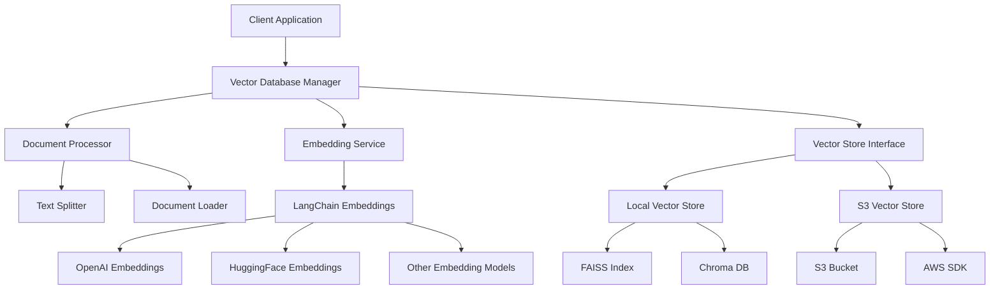

# Design Document

## Overview

The LangChain Vector Database system will be implemented as a modular Python application that provides a unified interface for document ingestion, vector storage, and semantic search operations. The system will support multiple storage backends including local file systems and AWS S3, with pluggable embedding models through LangChain's ecosystem.

The architecture follows a layered approach with clear separation between the embedding generation, vector storage, and query processing components. This design enables easy extension to support additional vector stores and embedding models in the future.

## Architecture



## Components and Interfaces

### VectorDatabaseManager
The main orchestrator class that coordinates all operations.

**Interface:**
```python
class VectorDatabaseManager:
    def __init__(self, config: VectorDBConfig)
    def add_documents(self, documents: List[Document]) -> List[str]
    def add_texts(self, texts: List[str], metadatas: List[dict] = None) -> List[str]
    def similarity_search(self, query: str, k: int = 4) -> List[Document]
    def similarity_search_with_score(self, query: str, k: int = 4) -> List[Tuple[Document, float]]
    def update_document(self, doc_id: str, document: Document) -> bool
    def delete_documents(self, doc_ids: List[str]) -> bool
    def get_document_metadata(self, doc_id: str) -> dict
    def persist(self) -> bool
    def load(self) -> bool
```

### DocumentProcessor
Handles document loading, text splitting, and preprocessing.

**Interface:**
```python
class DocumentProcessor:
    def __init__(self, chunk_size: int = 1000, chunk_overlap: int = 200)
    def process_documents(self, file_paths: List[str]) -> List[Document]
    def process_texts(self, texts: List[str], metadatas: List[dict] = None) -> List[Document]
    def split_text(self, text: str) -> List[str]
```

### EmbeddingService
Abstracts embedding model operations using LangChain.

**Interface:**
```python
class EmbeddingService:
    def __init__(self, embedding_model: str, model_kwargs: dict = None)
    def embed_documents(self, texts: List[str]) -> List[List[float]]
    def embed_query(self, text: str) -> List[float]
    def get_embedding_dimension(self) -> int
```

### VectorStoreInterface
Abstract base class for different vector storage backends.

**Interface:**
```python
class VectorStoreInterface(ABC):
    @abstractmethod
    def add_vectors(self, vectors: List[List[float]], documents: List[Document]) -> List[str]
    @abstractmethod
    def search_vectors(self, query_vector: List[float], k: int) -> List[Tuple[Document, float]]
    @abstractmethod
    def update_vector(self, doc_id: str, vector: List[float], document: Document) -> bool
    @abstractmethod
    def delete_vectors(self, doc_ids: List[str]) -> bool
    @abstractmethod
    def get_document(self, doc_id: str) -> Document
    @abstractmethod
    def persist(self) -> bool
    @abstractmethod
    def load(self) -> bool
```

### LocalVectorStore
Implementation for local file system storage using FAISS or Chroma.

**Key Features:**
- Uses FAISS for efficient similarity search
- Stores metadata in JSON files
- Supports incremental updates
- Automatic persistence to disk

### S3VectorStore
Implementation for AWS S3 storage backend.

**Key Features:**
- Stores vector indices as compressed files in S3
- Uses S3 object metadata for document information
- Implements efficient batching for S3 operations
- Supports versioning and backup strategies

## Data Models

### VectorDBConfig
Configuration class for the vector database system.

```python
@dataclass
class VectorDBConfig:
    storage_type: str  # "local" or "s3"
    embedding_model: str  # "openai", "huggingface", etc.
    storage_path: str  # Local path or S3 bucket name
    
    # Embedding model specific config
    model_kwargs: dict = field(default_factory=dict)
    
    # Storage specific config
    storage_kwargs: dict = field(default_factory=dict)
    
    # Document processing config
    chunk_size: int = 1000
    chunk_overlap: int = 200
    
    # AWS S3 specific config (when storage_type="s3")
    aws_access_key_id: str = None
    aws_secret_access_key: str = None
    aws_region: str = "us-east-1"
    s3_prefix: str = "vectors/"
```

### Document
Extended LangChain Document class with additional metadata.

```python
@dataclass
class Document:
    page_content: str
    metadata: dict = field(default_factory=dict)
    doc_id: str = None
    embedding: List[float] = None
    created_at: datetime = None
    updated_at: datetime = None
```

## Error Handling

### Exception Hierarchy
```python
class VectorDBException(Exception):
    """Base exception for vector database operations"""
    pass

class EmbeddingException(VectorDBException):
    """Raised when embedding generation fails"""
    pass

class StorageException(VectorDBException):
    """Raised when storage operations fail"""
    pass

class ConfigurationException(VectorDBException):
    """Raised when configuration is invalid"""
    pass

class S3Exception(StorageException):
    """Raised when S3 operations fail"""
    pass
```

### Error Handling Strategy
- All operations return success/failure status with detailed error messages
- Retry logic with exponential backoff for network operations (S3)
- Graceful degradation when optional features fail
- Comprehensive logging for debugging and monitoring
- Input validation with clear error messages

### S3 Specific Error Handling
- Authentication failures: Clear credential error messages
- Network timeouts: Automatic retry with backoff
- Bucket access issues: Permission-specific error guidance
- Large file handling: Multipart upload with progress tracking

## Testing Strategy

### Unit Testing
- Mock external dependencies (OpenAI API, AWS S3)
- Test each component in isolation
- Comprehensive test coverage for error conditions
- Property-based testing for vector operations

### Integration Testing
- End-to-end workflows with real embedding models
- S3 integration tests with test buckets
- Performance testing with various document sizes
- Concurrent operation testing

### Test Data Strategy
- Sample documents of various formats (PDF, TXT, MD)
- Test embeddings with known similarity relationships
- Mock S3 responses for consistent testing
- Benchmark datasets for performance validation

### Performance Testing
- Vector search latency benchmarks
- Memory usage profiling with large document sets
- S3 operation performance under various network conditions
- Concurrent user simulation testing